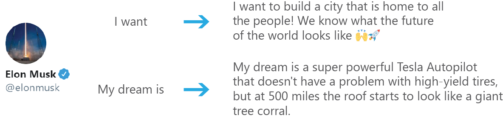

# HuggingTweets - Train a model to generate tweets

*Create in 5 minutes a tweet generator based on your favorite Tweeter*

## [Make my own model with the demo →](https://colab.research.google.com/github/borisdayma/huggingtweets/blob/master/huggingtweets-demo.ipynb)

## Introduction

I developed HuggingTweets to try to predict Elon Musk's next breakthrough 😉

This project fine-tunes a pre-trained neural network on a user's tweets using [HuggingFace Transformers](https://huggingface.co/), an awesome open source library for Natural Language Processing. The resulting model can then generate new tweets for you!

Training and results are automatically logged into [W&B](https://docs.wandb.com) through the [HuggingFace integration](https://docs.wandb.com/huggingface).

## Usage

To test the demo, click on below link and share your predictions!

You can also use it locally by installing the dependencies with `pipenv` or `pip` and use [`huggingtweets-demo.ipynb`](huggingtweets-demo.ipynb)

## Results

My favorite sample is definitely on Andrej Karpathy, start of sentence "I don't like":

> I don't like this :) 9:20am: Forget this little low code and preprocessor optimization. Even if it's neat, for top-level projects. 9:27am: Other useful code examples? It's not kind of best code, :) 9:37am: Python drawing bug like crazy, restarts regular web browsing ;) 9:46am: Okay, I don't mind. Maybe I should try that out! I'll investigate it :) 10:00am: I think I should try Shigemitsu's imgur page. Or the minimalist website if you're after 10/10 results :) Also maybe Google ImageNet on "Yelp" instead :) 10:05am: Looking forward to watching it talk!

I had a lot of fun running predictions on other people too!

## How does it work?

To understand how the model was developed, check my [W&B report](https://app.wandb.ai/wandb/huggingtweets/reports/HuggingTweets-Train-a-model-to-generate-tweets--VmlldzoxMTY5MjI).

You can also explore the development version
[`huggingtweets-dev.ipynb`](dev/huggingtweets-dev.ipynb) or use the following link.

Required files to run [W&B sweeps](http://docs.wandb.com/) are in [`dev`](dev/) folder.

## Future research

I still have more research to do:

* evaluate how to "merge" two different personalities ;
* test training top layers vs bottom layers to see how it affects learning of lexical field (subject of content) vs word predictions, memorization vs creativity ;
* augment text data with adversarial approaches ;
* pre-train on large Twitter dataset of many people ;
* explore few-shot learning approaches as we have limited data per user though there are probably only few writing styles ;
* implement a pipeline to continuously train the network on new tweets ;
* cluster users and identify topics, writing style…

## About

*Built by Boris Dayma*

My main goals with this project are:

* to experiment with how to train, deploy and maintain neural networks in production ;
* to make AI accessible to everyone ;
* to have fun!

For more details, visit the project repository.

**Disclaimer: this project is not to be used to publish any false generated information but to perform research on Natural Language Generation.**

## FAQ

1. Does this project pose a risk of being used for disinformation?

    Large NLP models can be misused to publish false data. OpenAI performed a [staged release of GPT-2](https://openai.com/blog/gpt-2-6-month-follow-up/) to study any potential misuse of their models.

    I want to ensure latest AI technologies are accessible to everyone to ensure fairness and prevent social inequality.

    HuggingTweets shall not be used for creating innapropriate content, nor for any illicit or unethical purposes. Any generated text from other users tweets must explicitly be referenced as such and cannot be published with the intent of hiding their origin. No generated content can be published against a person unwilling to have their data used as such.

1. Why is the demo in colab instead of being a real independent web app?

    It actually looks much better with [Voilà](https://github.com/voila-dashboards/voila) as the code cells are hidden and automatically executed. Also we can easily deploy it through for free on [Binder](https://mybinder.org/).

    However training such large neural networks requires GPU (not available on Binder, and not cheap) and I wanted to make HuggingTweets accessible to everybody. [Google Colab](https://colab.research.google.com/) generously offers free GPU so is the perfect place to host the demo.

## Resources

* [Explore the W&B report](https://app.wandb.ai/wandb/huggingtweets/reports/HuggingTweets-Train-a-model-to-generate-tweets--VmlldzoxMTY5MjI) to understand how the model works
* [HuggingFace and W&B integration documentation](https://docs.wandb.com/library/integrations/huggingface)

## Got questions about W&B?

If you have any questions about using W&B to track your model performance and predictions, please reach out to the [slack community](http://bit.ly/wandb-forum).

## Acknowledgements

I was able to make the first version of this program in just a few days.

It would not have been possible without these people and these open-source tools:

* [W&B](http://docs.wandb.com/) for the great tracking & visualization tools for ML experiments ;
* [HuggingFace](https://huggingface.co/) for providing a great framework for Natural Language Understanding ;
* [Tweepy](https://www.tweepy.org/) for providing a great API to interact with Twitter (used in the dev notebook) ;
* [Chris Van Pelt](https://github.com/vanpelt) for hacking with me on the demo ;
* [Lavanya Shukla](https://github.com/lavanyashukla) for her great continuous feedback on the demo ;
* [Google Colab](https://colab.research.google.com/) for letting people access free GPU!
